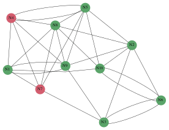
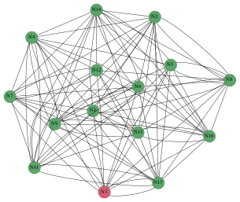
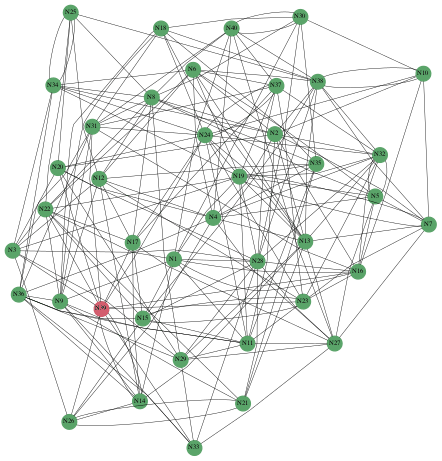
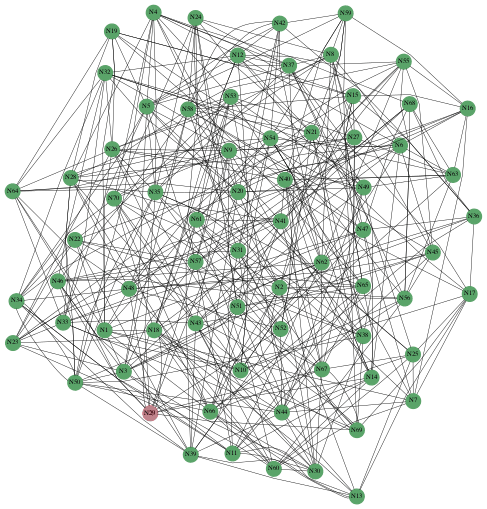
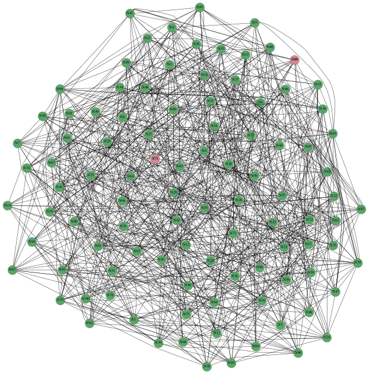

# gossip-sim

A simulator for spreading information in a network of partially connected nodes via gossip. Gossip
protocols are based on epidemiology and the way viruses spread. They offer powerful and versatile
techniques for efficient communication in distributed system. For more information, e.g. see linked
articles [here](https://en.wikipedia.org/wiki/Gossip_protocol#References).

This simulator by no means tries to be feature complete or generic. Its use is to show the
propagation of a piece of (arbitrary) information through a network of nodes, where some nodes are
connected to some other, but none of the nodes has a view of the entire network. Results can be
serialized to Json and rendered into a gif showing how the information propagated through the
network (see [Examples](#examples)).

## Build

To build the project you need to have `cmake` >= 3.12, `boost` >= 1.74.0 and `conan` installed. On
macOS those can be installed via `brew`.

Dependencies other than `boost` can be installed via `conan`:
[nlohmann/json](https://github.com/nlohmann/json) and
[ericniebler/range-v3](https://github.com/ericniebler/range-v3).

All dependencies from `conan` only need to be installed once after initial checkout:

```
$ mkdir build
$ cd build
$ conan install .. # reads requirements from conanfile.txt
```

Following this step, run `cmake` with your favorite generator and build the project.

Further, two Python helper scripts are included in `util/`
(see [Python scripts](#python-scripts)), `requirements.txt` lists their dependencies.
Please run with Python 3.x (tested with 3.8).

## Run

The resulting binary, `gossip-sim`, can be parameterized as follows:

```
$ build/bin/gossip-sim --help
Allowed options:
  --help                produce help message
  --num-nodes arg       total number of nodes
  --num-neighbors arg   number of neighbors per node
  --period-sec arg (=5) gossip interval
  --fanout arg (=1)     fanout per round of gossip
  --json-out arg        path to write results as Json
```

 * `num-nodes`: (required) sets the total number of nodes in the network
 * `num-neighbors`: (required) sets the number of neighbors per node; Neighbors are chosen randomly
     per node, from the list of all nodes except itself (i.e. no loops are created). This number
     can't be greater than `num-nodes`.
 * `period-sec`: (optional, default `5`) defines how often nodes will send the message to a number
     of randomly chosen neighbors (i.e. contribute to gossip, see `fanout`); A node will only start
     with gossip rounds once it received the message itself.
 * `fanout`: (optional, default `1`) defines the number of randomly chosen neighbors per gossip
     round; This number can't be greater than `num-neighbors`.
 * `json-out`: (optional) if set, results will be written to the given path in a Json format that
     can be fed into `generate_gif.py` (see [Render the results](#render-the-results))

On startup the network will be built by randomly choosing neighbors according to the given
parameters (for details, see [Generating the network](#generating-the-network)), and each
node prints their state:

```
$ build/bin/gossip-sim --num-nodes 10 --num-neighbors 4 --period-sec 1 --fanout 2
Initializing simulator - #nodes=10, #neighbors=4, period=1000ms, fanout=2
49152 started, neighbors=[ 49154 49156 49158 49159 ], period=1000ms, fanout=2
49153 started, neighbors=[ 49152 49155 49156 49157 ], period=1000ms, fanout=2
49154 started, neighbors=[ 49152 49156 49157 49159 ], period=1000ms, fanout=2
49155 started, neighbors=[ 49153 49154 49160 49161 ], period=1000ms, fanout=2
49156 started, neighbors=[ 49154 49157 49158 49160 ], period=1000ms, fanout=2
49157 started, neighbors=[ 49152 49158 49160 49161 ], period=1000ms, fanout=2
49158 started, neighbors=[ 49153 49155 49157 49159 ], period=1000ms, fanout=2
49159 started, neighbors=[ 49154 49156 49157 49161 ], period=1000ms, fanout=2
49160 started, neighbors=[ 49152 49156 49158 49161 ], period=1000ms, fanout=2
49161 started, neighbors=[ 49153 49156 49158 49159 ], period=1000ms, fanout=2
```

At this point no node received any message yet, so no gossip is happening. In order to start the
spreading of information, a message needs to be injected to any node, which is as simple as
writing to the respective UDP port (e.g. `49152` for the first node in the above example).
`inject_message.py` is provided for convenience (see [Inject a message](#inject-a-message)).

As soon as a message is injected, the receiving node will start its gossip rounds, and once its
neighbors receive the message, they will contribute to gossip as well. All fanouts happening
during this process are shown in the output (for above example, each gossip round nodes will
select two random neighbors). In the following example, node `49154` was chosen for the inital
message injection:

```
49154 fanout to [ 49156 49152 ]
49152 fanout to [ 49156 49159 ]
49154 fanout to [ 49156 49157 ]
49156 fanout to [ 49157 49158 ]
49152 fanout to [ 49158 49159 ]
49154 fanout to [ 49156 49152 ]
49156 fanout to [ 49157 49158 ]
49157 fanout to [ 49152 49161 ]
49158 fanout to [ 49155 49159 ]
49159 fanout to [ 49156 49161 ]
49152 fanout to [ 49159 49154 ]
49154 fanout to [ 49157 49152 ]
49155 fanout to [ 49153 49160 ]
49156 fanout to [ 49157 49160 ]
49157 fanout to [ 49158 49152 ]
49158 fanout to [ 49155 49159 ]
49159 fanout to [ 49161 49154 ]
49160 fanout to [ 49156 49152 ]
49161 fanout to [ 49153 49156 ]
```

Once all nodes received the message at least once, `gossip-sim` will stop automatically and print
some information and statistics:

```
49152: latency=359ms, received=4, sent=3
49153: latency=3367ms, received=1, sent=0
49154: latency=0ms, received=2, sent=4
49155: latency=2364ms, received=1, sent=1
49156: latency=359ms, received=5, sent=3
49157: latency=1361ms, received=4, sent=2
49158: latency=1361ms, received=3, sent=2
49159: latency=1361ms, received=4, sent=2
49160: latency=3366ms, received=2, sent=1
49161: latency=2364ms, received=2, sent=1
---
Avg. latency: 1626ms
Max. latency: 3367ms
Rounds of gossip: 4
```

From above output it can also be seen that node `49154` was chosen initially, as it reports its
latency to receive the message as `0ms`. Further it's clear that `49153` received the message
last, as its latency is equal to the maximum latency, and it also didn't participate in any
gossip rounds itself (the program stopped before it could do so).

### Generating the Network

On startup a directed graph is generated, where each vertex initially has a number of outgoing
edges according to the given number of neighbors (`num-neighbors`). Edges are chosen among the
full set of vertices available (`num-nodes`), however without allowing loops. The resulting graph
is then tested for strongly connected components (SCC) using
[Kosaraju's algorithm](https://en.wikipedia.org/wiki/Kosaraju%27s_algorithm). If it contains
more than one SCC, the `Graph` component will try to connect those components to generate a
graph with only one SCC. This is a requirement for the simulator, which assumes that the
network of nodes is not partitioned, hence guaranteeing the information being spread is
able to eventually reach all the nodes, independent of where the information was initially
injected.

The resulting network might therefore contain nodes which have more than the given
`num-neighbors` number of neighbors. In the following example, initial random neighbor
selection required to add an additional neighbor to six of the nodes to guarantee only
one SCC:

```
$ build/bin/gossip-sim --num-nodes 10 --num-neighbors 1 --period-sec 1 --fanout 1
Initializing simulator - #nodes=10, #neighbors=1, period=1000ms, fanout=1
49153 started, neighbors=[ 49162 49155 ], period=1000ms, fanout=1
49154 started, neighbors=[ 49161 ], period=1000ms, fanout=1
49155 started, neighbors=[ 49159 49156 ], period=1000ms, fanout=1
49156 started, neighbors=[ 49160 49158 ], period=1000ms, fanout=1
49157 started, neighbors=[ 49160 ], period=1000ms, fanout=1
49158 started, neighbors=[ 49162 49159 ], period=1000ms, fanout=1
49159 started, neighbors=[ 49153 49162 ], period=1000ms, fanout=1
49160 started, neighbors=[ 49154 49153 ], period=1000ms, fanout=1
49161 started, neighbors=[ 49157 ], period=1000ms, fanout=1
49162 started, neighbors=[ 49157 ], period=1000ms, fanout=1
```

### Python scripts

#### Inject a message

As mentioned above, injecting a message to start the gossip process is as easy as sending any
number of bytes to one of the UDP ports of the active nodes. A Python script, `inject_message.py`,
is provided as well:

```
$ python util/inject_message.py --port 49154
Wrote 13 bytes to :49154
```

#### Render the results

When choosing to write Json results via passing `json-out` when starting the program, the
resulting file can be passed to a Python script, `generate_gif.py`, in order to generate a
gif which will show how the message spread among the nodes. The indivdual images are generated
using [Graphviz](https://graphviz.org/).

```
$ python util/generate_gif.py --json example.json --gif example.gif
Wrote intermediate step to /var/folders/97/j78zv_0x2h1c0ppw7n5pktq80000gn/T/tmpaso7oc0h
Wrote intermediate step to /var/folders/97/j78zv_0x2h1c0ppw7n5pktq80000gn/T/tmpqqy4wel9
Wrote intermediate step to /var/folders/97/j78zv_0x2h1c0ppw7n5pktq80000gn/T/tmp1h7_rmu8
Wrote intermediate step to /var/folders/97/j78zv_0x2h1c0ppw7n5pktq80000gn/T/tmpjg2y9dh9
Wrote intermediate step to /var/folders/97/j78zv_0x2h1c0ppw7n5pktq80000gn/T/tmpsz73cvpp
Wrote gif to example.gif
```

## Examples

### Small networks

 * 10 nodes, 3 neighbors, fanout 1



 * 15 nodes, 7 neighbors, fanout 2



### Medium networks

 * 40 nodes, 5 neighbors, fanout 3



 * 70 nodes, 6 neighbors, fanout 3



### Large network

 * 100 nodes, 9 neighbors, fanout 3



 * 300 nodes, 20 neighbors, fanout 4


